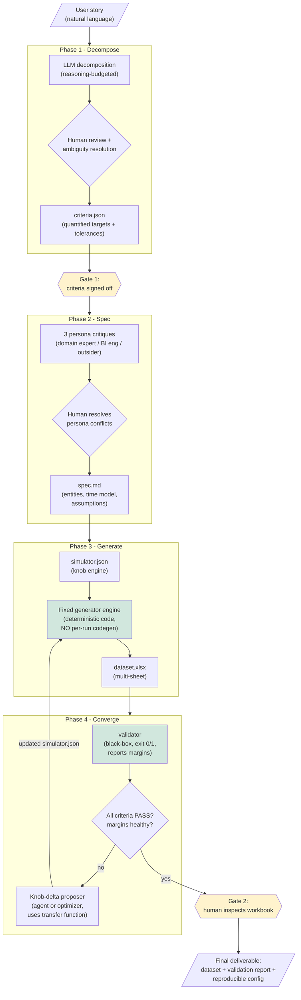

# SynGen Architecture

> **Status:** v1 draft — the mental model for the full build. Everything here is grounded in the four validated experiments (see `EXPERIMENTS_REPORT.md`). Docs in this series: `ARCHITECTURE.md` (this), `ARTIFACT_CONTRACTS.md`, `DATA_MODEL.md`, `AGENT_ROLES.md`, `UX_WIREFRAME.md`, `GAPS_AND_RISKS.md`.

---

## 1. System Overview

SynGen is an **agentic harness** that converts a business story into a synthetic multi-table dataset that demonstrably lands that story. It is not a deterministic pipeline — it is an orchestrator coordinating LLM reasoning, deterministic engines, and human approval, connected by **file contracts**.

The founding principle (validated in Experiment B): **phases communicate through artifacts on disk, not function calls.** Each phase consumes files and produces files. This makes every phase independently testable, replayable, and debuggable — and it is what allowed all four experiments to run in isolation.

```
Story ──> criteria.json ──> spec + simulator.json ──> dataset.xlsx ──> validation report
              (Phase 1)          (Phases 2–3)                          (Phase 4 loop)
```

---

## 2. Master Flow Chart



**Legend:** green = deterministic code (never LLM-generated per run) · yellow = mandatory human gates · everything else = LLM-assisted reasoning steps.

---

## 3. The Convergence Sub-Loop (Heart of the System)

Experiment D proved this loop converges in 2 iterations with a predictable transfer function:

```mermaid
flowchart LR
    A[simulator.json knobs] --> B[Generator engine]
    B --> C[dataset.xlsx]
    C --> D[Validator:<br/>per-criterion actual vs target vs tolerance + margin]
    D --> E{exit code}
    E -- "0: all pass" --> F[Done]
    E -- "1: failures" --> G[Classify each failure:<br/>parametric or statistical?]
    G --> H[Propose knob deltas<br/>(compensating, multi-criterion aware)]
    H --> A
```

Loop rules learned from Experiment D:
- **Classify before turning:** statistical failures (sampling noise) need volume/seed changes; parametric failures need knob shifts. Greedy single-knob adjustment oscillates because **knobs stack**.
- **Margin-aware:** passing at +0.03pp over threshold is not converged. The validator reports margins; the loop targets mid-band.
- **Budget-capped:** hard iteration limit (experiments converged in 2; cap at ~10) after which the harness escalates to the human with a diagnosis.

---

## 4. Phase-to-Experiment Traceability

Every design decision below is anchored to something we validated, not assumed.

| Phase | Design decision | Validated by |
|-------|----------------|--------------|
| 1 | LLM decomposes stories into quantified criteria | A: human + LLM decompositions converged ~1:1 |
| 1 | Explicit ambiguity-resolution step | A: windows/tolerances were the real disagreements |
| 1 | Reasoning-model token budgeting | A: empty output at max_tokens=2048 |
| 2 | Persona critique of spec | Not yet tested — first untested surface (see GAPS doc) |
| 3 | Config-driven generation, fixed engine, no per-run codegen | B: zero code changes across all iterations |
| 3 | Determinism via seed in config | B: byte-stable data across runs |
| 3 | Multi-sheet Excel as native output | User requirement from day 1 |
| 4 | Black-box validation against workbook only | C: caught all 4 deliberate mutations |
| 4 | Exit-code-driven automation | C: 0/1 codes worked in test harness |
| 4 | Statistical-vs-parametric failure classification | D: AC1 needed volume, not tuning |
| 4 | Compensating multi-knob moves | D: boost raise broke AC2 until Q1 bases lowered |

---

## 5. Component Inventory

What is deterministic code, what is an LLM call, what is a human decision.

| Component | Type | Rationale |
|-----------|------|-----------|
| Story intake & session management | Deterministic code | No intelligence needed |
| Story → criteria draft | LLM call | Language understanding core task |
| Criteria sign-off | Human gate | Owner judgment is the point of Experiment A's review step |
| Persona critiques (×3) | LLM calls (parallel) | Independent perspectives; conflicts resolved by human |
| simulator.json authoring | LLM-assisted, human-approved | Draft from spec; knobs are business decisions |
| Generator engine | Deterministic code, permanent | B's lesson: never generate generator code per run |
| Validator | Deterministic code, permanent | Must be trustworthy; C's two-direction tests are its CI |
| Knob-delta proposal | LLM call (with transfer-function context) or optimizer | Small search space; agent reads validator table + margins |
| Final delivery packaging | Deterministic code | Workbook + report + config bundle |

**LLM backend:** OpenAI-compatible abstraction (`llm.config`), default endpoint = local llama.cpp server. Config must carry `max_tokens` headroom for reasoning models (A's lesson) and capture both `content` and `reasoning_content` fields.

---

## 6. Non-Goals for v1 (Parking Lot)

From Idea_v2, restated as explicit boundaries:

- ❌ Multi-agent orchestration frameworks — one orchestrator + role-prompted LLM calls is enough until proven otherwise
- ❌ Web UI — CLI conversational first (wireframes in `UX_WIREFRAME.md`)
- ❌ Multiple domains beyond RevOps templates — second domain only after first vertical slice generalizes
- ❌ True gross-margin modeling — requires cost data model we deliberately exclude (A's finding)
- ❌ Auto-publishing to BI tools — deliver files; integration later

---

## 7. Open Architectural Questions

Tracked in detail in `GAPS_AND_RISKS.md`; listed here so the mental model stays honest:

1. Who authors simulator.json initially — Phase 2 personas or a dedicated Phase 3 step? (Lean: Phase 3, seeded by spec.)
2. Does the knob-proposer get the generator's transfer function explicitly, or learn it from iteration history? (Lean: explicit formula from D's learnings, refined by history.)
3. How are criteria re-negotiated when they prove unconvergeable (like AC5's thin margin)? Needs a formal change protocol rather than silent loosening.
