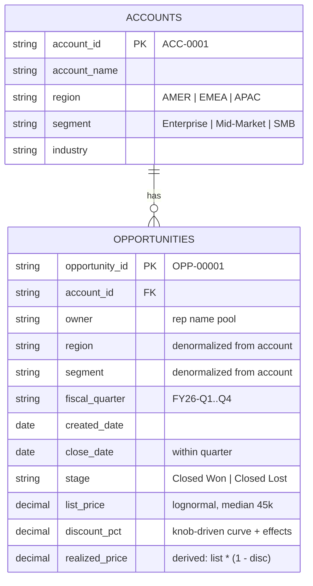

# SynGen Data Model

> **Status:** v1 draft. Two layers: (1) the concrete demo data model proven in experiments, (2) the generalized spec-driven model the harness will produce per-story. The generator engine must handle layer 2; layer 1 is its first instance.
>
> **Update (2026-08-25, M6):** §1's diagram below is the stale v0 closed-won-only model. The current canonical entity schemas live in `ENTITY_SCHEMA.md` (review draft); that document supersedes §1.

---

## 1. Demo Data Model (validated in Experiments B–D)



### Grain decisions (pinned)
- **accounts grain:** one row per selling account. No history/scd — v1 snapshots only.
- **opportunities grain:** one row per closed opportunity. Open pipeline is out of scope for this story type (validator metrics only need terminal states).
- **Denormalization is deliberate:** `region`/`segment` copied onto opportunities so validators and BI tools can aggregate without joins. Synthetic demo data optimizes for consumer convenience, not storage normalization.

### Derived-field rule
`realized_price` is computed from `list_price` and `discount_pct` at generation time — never sampled independently. Inconsistency between derived fields is an AC8-class sanity violation.

---

## 2. Generalized Model (what Phase 2/3 will emit per story)

The harness does NOT hardcode this schema. Per Idea_v2 Phase 2, entities/measures/time-model come from the spec. The generator engine understands a fixed vocabulary of field types and effects:

### Field type vocabulary (generator must implement once)
| Type | Params | Used for |
|------|--------|----------|
| `categorical` | values + weights | region, segment, industry |
| `lognormal` | median, sigma | deal sizes, revenue amounts |
| `normal` | mean, sd, clip | continuous measures |
| `uniform_int` | lo, hi | durations, counts |
| `date_in_period` | clustering rules | close dates with EOQ weighting |
| `derived` | formula over sibling fields | realized_price |

### Effect vocabulary (the knobs)
| Effect | Alters | Proven in |
|--------|--------|-----------|
| `group_period_curve` | field base value by group × period | D: AC2–AC5 |
| `window_boost` | field inside date window | D: AC6 |
| `noise` | per-row jitter | B: realism |
| `outcome_assignment` | bernoulli vs exact_count rates | D: AC1 fix path |

**Rule:** a new story requiring a new effect type = engine version bump + test. A new story using existing types = config only. This boundary keeps the "no per-run codegen" promise auditable.

---

## 3. Summary Sheets

`quarterly_summary`-style sheets are always **derived views** computed from fact rows at write time:

```
summary = groupby(fact, period).agg(
    counts, rates, weighted averages, sums
)
```

They exist because BI demos start from friendly aggregates. They are never inputs to validation (validator recomputes from raw rows — C's black-box rule).

---

## 5. Schema Linter (Quality Gate)

Validated in Experiment E (`experiments/E_schema_qc/schema_linter.py`). Runs at Gate 1 on the spec, and post-generation on the workbook schema. Deterministic code — never an LLM judgment.

| Rule | Catches | Severity |
|------|---------|----------|
| R1 duplicate_grain | Two entities at the same grain (the "opportunities + deals" failure mode) | FAIL |
| R2 stored_aggregate | Pre-computed rollup stored as a fact table | FAIL |
| R3 dangling_reference | FK-style fields without declared references | WARN |
| R4 taxonomy_completeness | Dimension uses subset of real-world taxonomy (story says Enterprise/Mid-Market; world silently loses CSB/SMB) | ADVISE → human decision at gate |
| R5 redundant_status | Overlapping lifecycle fields (`stage` + `close_status`) | FAIL |

**Defense-in-depth finding from E:** the strict BI-engineer prompt prevents most pathologies at generation time, but prompts are probabilistic — the linter guarantees what the prompt merely encourages. Both layers are required.

---

## 6. Known Limitations (fed to GAPS_AND_RISKS.md)

1. No open-pipeline state machine — stories about pipeline coverage (like the original moonshot) need in-flight deals with stages. Engine extension required.
2. Single fact table — multi-fact stories (e.g., orders + shipments) need relationship-aware generation order (parents before children).
3. No slowly-changing dimensions — fine for quarterly demos, wrong for longitudinal studies.
4. Region/segment denormalization will drift if entity-level attributes change mid-simulation — acceptable at v1 scale.
