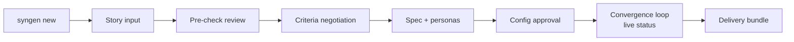

# SynGen UX Wireframes (CLI v1)

> **Status:** v1 draft. Conversational CLI, in the spirit of "Claude Code for synthetic data." Architecture docs stay UI-agnostic; this doc is allowed to be CLI-specific.

---

## Session Flow Overview



---

## Wireframe 1 — Session Start & Story Intake

```
$ syngen new

  SynGen ── story → dataset
  ─────────────────────────────
  No session found. Starting fresh.

  ? Paste or attach your business story (ends with blank line):

  > Pipeline coverage remained healthy at 3.5x, but next-quarter revenue
  > risk increased...

  ✓ Story captured (48 words)

  Pre-check: I found 4 claims in this story:
    1. "coverage ~3.5x"            → computable (ratio of pipeline to target)
    2. "concentrated in few deals" → computable (concentration index)
    3. "forecast volatility"       → computable (quarterly variance) [assumption needed]
    4. "underlying issue was intelligence" → NOT computable from tabular data
       ↳ this is narrative framing; it will be reflected via claims 2–3, not measured

  Proceed with claims 1–3 as measurable targets? (Y/n/edit)
```

**Design notes:** the pre-check mirrors Experiment A's biggest win (catching non-computable claims early). Framing-only language gets acknowledged, not silently dropped.

---

## Wireframe 2 — Criteria Negotiation (Gate 1)

```
  Draft acceptance criteria:

  ID   Criterion                          Target              Tolerance
  AC1  Win rate flat across quarters      annual mean         ±3pp
  AC2  Q1 avg discount                    12%                 ±2pp
  ...

  Ambiguities I resolved (edit any):
  · "end-of-quarter" = final 14 days of each quarter
  · discounts measured on Closed-Won deals only
  · "this year" = FY26 (4 quarters assumed)

  ? Edit criteria interactively? (e/c/accept)
  > e
  AC5 tolerance [+5pp]: 4
  ✓ AC5 updated.

  ? Sign off criteria and proceed to spec? (Y/n)
  > y
  ✓ Gate 1 passed — criteria.json saved.
```

**Design notes:** tolerances are first-class editable values (they decided convergence difficulty in D). Resolved ambiguities shown explicitly — never silently applied.

---

## Wireframe 3 — Spec & Config Approval

```
  Three reviewers critiqued the spec:

  Domain expert:  "EMEA premium should emerge over time, not exist in Q1"
  BI engineer:    "denormalize region onto opportunities for easy pivots"
  Outsider:       "'healthy' coverage implies a target number — assumed 3.0x"

  1 conflict needs your call:
  · Expert wants premium scoped to H2; outsider assumed full-year.
    [H2 / full-year / explain more]

  ✓ spec.md saved.
  ✓ simulator.json drafted (11 knobs). Review? (y/n)
  > y
     seed: 42          per_quarter: 400      win_rate: 0.27 ±0.005
     discount curves:  AMER [12, 14, 15.5, 15.5] ...
  ? Generate first dataset? (Y/n)
```

---

## Wireframe 4 — Convergence Loop (Live Status)

```
  Iterating to land your story...  (cap: 10 iterations)

  ── Iteration 1 ──────────────────────────────────────
  AC1 ▓▓▓▓▓▓▓▓░░ PASS   win-rate dev 1.88pp (band 3.0)
  AC2 ▓▓▓▓▓▓▓▓▓░ PASS   Q1 disc 13.24% (12±2)
  AC6 ░▓▓▓▓▓▓▓░░ FAIL   EOQ gap +4.79pp (need ≥5.0) margin -0.21
  AC7 ▓▓▓▓▓▓▓▓▓░ PASS   realized/list 86.7→81.5%

  Adjusting: boost_pp 5.5→6.5, Q1 bases 12→11.5 (compensating move)
  Predicted: AC6 → +6.4 | AC2 stays <14

  ── Iteration 2 ──────────────────────────────────────
  All 8 criteria PASS ✓  (margins: min +0.03 on AC5)

  ⚠ AC5 margin is thin (+0.03pp). Options:
    1. Accept        2. Push toward mid-band (+2 iterations)        3. Show detail
  > 2
```

**Design notes:** margins visible per criterion (D's thin-margin lesson becomes UX). The loop shows its *reasoning* (adjustment + prediction), building trust and teachability. Thin-margin warning is proactive.

---

## Wireframe 5 — Delivery

```
  ✓ STORY LANDED in 2 iterations.

  Deliverables in ./sessions/2026-08-21_pipeline-story/
    dataset.xlsx          ← 3 sheets, opens in Excel/BI tools
    validation_report.md  ← proof the story landed (attach to your deck)
    simulator.json        ← tweak knobs anytime, regenerate deterministically
    session_log.md        ← full history

  ? Anything else? ("make Q3 worse", "add a region", "export CSV", "done")
  > make Q3 worse
  Interpreting: deepen Q3 discounts / soften Q3 win rate? (d/w/both)
```

**Design notes:** post-delivery iteration re-enters the loop at Phase 4 only — criteria get amended transparently, not silently. The validation report doubles as slide-ready evidence for the analytics team.

---

## Global CLI Principles

1. **Show the reasoning, not just results** — every automated move displays diagnosis + prediction
2. **Never silent** — assumptions, ambiguities, and compensating moves are always surfaced
3. **Human gates are blocking and cheap** — two gates total (criteria, delivery); everything else interruptible
4. **Every artifact has a path** — power users can leave the conversation and edit files directly; the CLI picks up changes on next command (`syngen validate`, `syngen iterate`)
